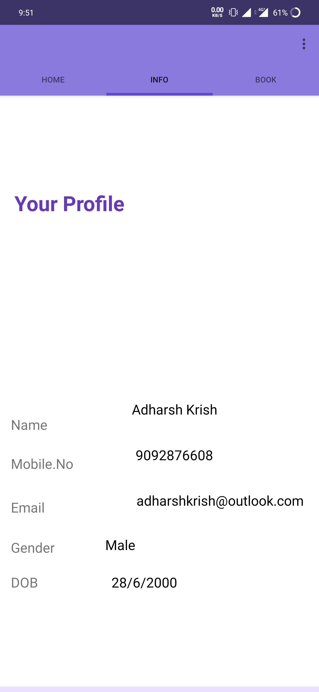
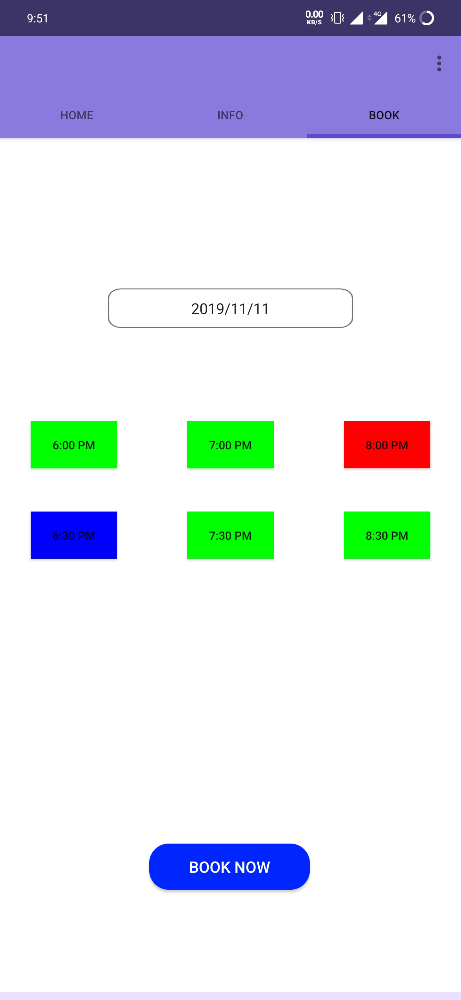

# Dentist appointment manager
Android app for doctor appointment and record management

<b>Home screen</b>

     The dentist information and the clinic location is pinned in the map view.
     The patient can view his past appointments by clicking on the 
     view appointments button.

<b>Info screen</b>

      The patient's information is available in this screen.

<b>Booking screen</b>

      The patient can book their appointments in the respective date and time where the 
      green buttons indicate available slots, red indicates booked and the blue indicates what 
      they've selected.

